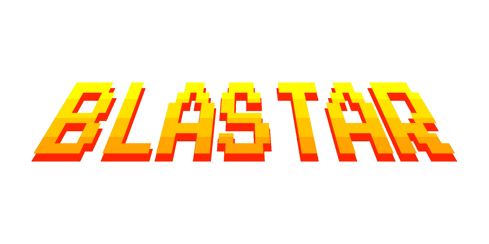

## Introduction 👋

Hi there! My goal when coming up with this game was making whoever is playing it feel nostalgic.
Since retro is defined '_imitating an old style_' I knew exactly what I had to do.
The process of making it was really fun even though I only had little time to code it.

## How to play 👾👾👾
You are (said to be) this excellent pilot flying through space.
While staring into infinity you will unexpectedly encounter a ton of beachballs.

Those so-called **beachballs of death** damage your ground which keeps you alive and can be seen as your health.
The beachballs will stop at a random y position and spin around their own anchorpoint for a couple of seconds before they hit you or your ground with accelerated speed.
The amount of healthpoints you loose is always 30hp. The rest hp of the beachball will by indicated by it's decreasing transparency. You have lasercanons attached to your spaceship with which you can weaken the beachballs. (Your lasercanons fire as soon as you end the current touch).
You can drag your ship anywhere on the x-axis as long as you tap and hold it.

Stay alive as long as you can.
But they are called **beachballs of death**, which means death is inevitable,...
_or is it_?

## Side note 📝

I used a bunch of workarounds and didn't tidy up my code because I simply couldn't afford spending more time on it.

I do think my playground stands a small chance but I don't expect to be accepted since I only spent 3 days on it.
I think others deserve to be invited more than me.
Everybody worked hard and I have my fingers crossed for all of you.

Promise me and yourself to keep it up.. no matter whether you will be accepted or not.
It would be a shame if a contest made you give up coding because thats the opposite of what its supposed to do.

Love to all of you
